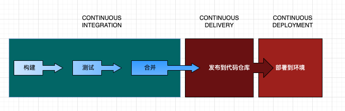

## CI/CD是什么

###### CI/CD是一种通过将自动化引|入应用程序开发阶段来频繁向客户交付应用程序的方法。CI/CD的主要概念是持续集成、持续交付和持续部署。CI/CD是解决集成新代码可能给开发和运营团队带来的问题（又名“集成地狱”）的解决方案。

###### 首字母缩略词 CI/CD有几个不同的含义。CI/CD中的"CI"总是指持续集成，它是开发人员的自动化过程。成功的CI意味着对应用程序的新代码更改会定期构建、测试并合并到共享存储库。这是解决同时开发的应用程序有太多分支可能相互冲突的问题的解决方案。

###### CI/CD中的"CD"指的是持续交付(Continuous Delivery)/持续部署(Continuous Deployment)，它们是有时可以互换使用的相关概念。两者都是关于自动化流水线的进一步阶段，但有时会单独使用它们来说明正在发生的自动化程度。

###### 持续交付通常意味着开发人员对应用程序的更改会自动进行错误测试并上传到存储库（如 GitHub 或容器注册表），然后运维团队可以将它们部署到实时生产环境中。这是对开发团队和业务团队之间可见性和沟通不佳问题的解决方案。为此，持续交付的目的是确保以最少的努力部署新代码。

###### 持续部署（另一种可能的"CD"）可以指自动将开发人员的更改从存储库发布到生产环境，供客户使用。它解决了频繁的应用程序人工部署使运维团队超载的问题。它通过自动化管道中的下一阶段来构建持续交付的优势。

### 持续继承CI

###### 在现代应用程序开发中，目标是让多个开发人员同时开发同一个应用程序的不同功能。但是，如果一个组织被设置为在某一天（"合并日"）将所有分支源代码合并在一起，那么最终的工作可能是乏味的、手动的和耗时的。这是因为当一个单独工作的开发人员对应用程序进行更改时，它可能会与其他开发人员同时进行的不同更改发生冲突。如果每个开发人员都定制了他们自己的本地集成开发环境(IDE)，而不是团队就一个基于云的 IDE 达成一致，这个问题可能会更加复杂。

###### 持续集成（CI) 帮助开发人员更频繁地将他们的代码更改合并回共享分支或“主干”——有时甚至每天。合并开发人员对应用程序的更改后，将通过自动构建应用程序并运行不同级别的自动化测试（通常是单元测试和集成测试）来验证这些更改，以确保更改不会破坏应用程序。这意味着测试从类和函数到构成整个应用程序的不同模块的所有内容。如果自动化测试发现新代码和现有代码之间存在冲突，CI可以更轻松地快速、频繁地修复这些错误。

### 持续交付CD

###### 在CI中的构建和单元和集成测试自动化之后，持续交付会自动将经过验证的代码发布到存储库。因此，为了有一个有效的持续交付过程，CI已经内置到您的开发管道中是很重要的。持续交付的目标是拥有一个始终准备好部署到生产环境的代码库。

###### 在持续交付中，从合并代码更改到交付生产就绪版本的每个阶段都涉及测试自动化和代码发布自动化。在该过程结束时，运营团队能够快速轻松地将应用程序部署到生产环境。

### 持续部署CD

###### 成熟的 CI/CD 管道的最后阶段是持续部署。作为持续交付的扩展，它可以自动将生产就绪的构建发布到代码存储库，持续部署可以自动将应用程序发布到生产环境。因为在生产前的流水线阶段没有人工门，持续部署在很大程度上依赖于精心设计的测试自动化。

###### 在实践中，持续部署意味着开发人员对云应用程序的更改可以在编写后几分钟内生效（假设它通过了自动化测试）。这使得持续接收和整合用户反馈变得更加容易。总而言之，所有这些连接的 CI/CD 实践降低了应用程序部署的风险，从而更容易以小块的形式发布对应用程序的更改，而不是一次全部发布。不过，也有很多前期投资，因为需要编写自动化测试以适应 CI/CD 管道中的各种测试和发布阶段。

## CI/CD管道代表什么？

###### CI/CD管道是一种集成自动化工具和工作流程的部署管道，旨在实现代码的频繁更改、自动化测试、持续集成和快速交付。通过CI/CD管道，开发团队可以在更短的时间内交付高质量的软件产品，提高开发效率和产品质量。

## CI/CD管道阶段

### 源代码管理

###### 使用版本控制系统（如Git）管理源代码，便于团队成员协同工作和版本控制。

### 构建

###### 通过自动化工具（如Jenkins）对源代码进行编译、打包和测试，确保代码质量。

### 测试

###### 自动化测试框架和工具用于执行单元测试、集成测试和端到端测试，确保软件质量。

### 部署

###### 自动化部署工具（如Docker）将构建好的软件包部署到生产环境或其他环境。

### 监控与反馈

###### 通过监控工具和日志收集系统（如Grafana）对应用程序性能和环境状态进行实时监控，及时发现问题并进行调整。
