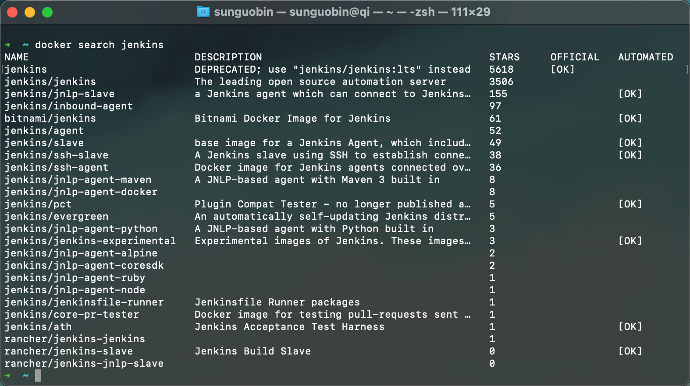
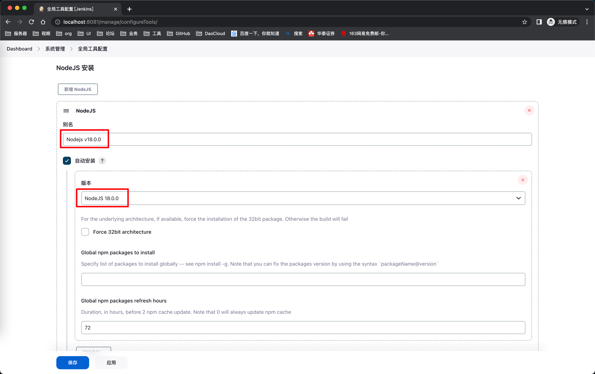

# 搭建Jenkins平台

## 1、Jenkins镜像

- ### [hub.docker.com](https://hub.docker.com)官方的镜像仓库

  

  

  #### `docker pull jenkins/jenkins`

- ### 控制台命令获取

  #### `docker search jenkins`

  

## 2、安装

- ### docker部署Jenkins

  #### `docker run --name jenkins_test -d -p 8081:8080 -p 50001:50000 jenkins/kenkins`

    - ##### 8080端口：Jenkins服务对外暴露的地址

    - ##### 50000端口：slave节点与Jenkins的通讯端口

    - ##### 非docker部署Jenkins需要保留8080端口和50000端口

      

## 3、配置Jenkins

- ### 解锁

    - #### 查询容器ID：`docker ps -a`

    - #### 进入容器：`docker exec -it ${CONTANINER ID} bash`

    - #### 查看密码：`cat /var/jenkins_home/secrets/initialAdminPassword`
      
      

      

- ### 初始化

  

  

  

- ### 插件（Dashboard > 系统管理 > 插件管理 > Available plugins）

    - #### Publish Over SSH：连接Linux机器，远程传输文件及执行Shell命令

      ###### Dashboard > 系统管理 > 系统配置 > Publish over SSH > SSH Servers

      

      ###### 配置完成可以点击右下角的`Test Confirguration`测试连接，左下角出现`Success`则说明配置成功，点击保存

      

    - #### Node：前端环境

      ###### Dashboard > 系统管理 > 全局工具配置 > NodeJS 安装
      
      

## 创建任务
