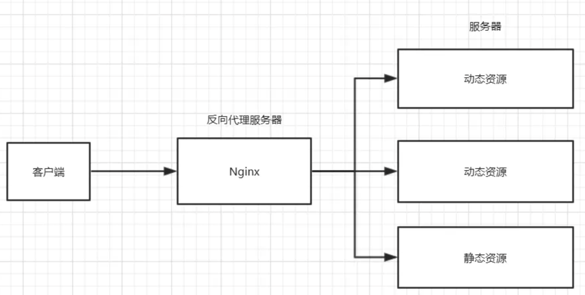
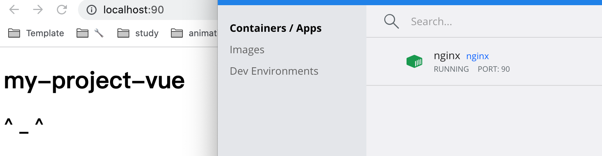
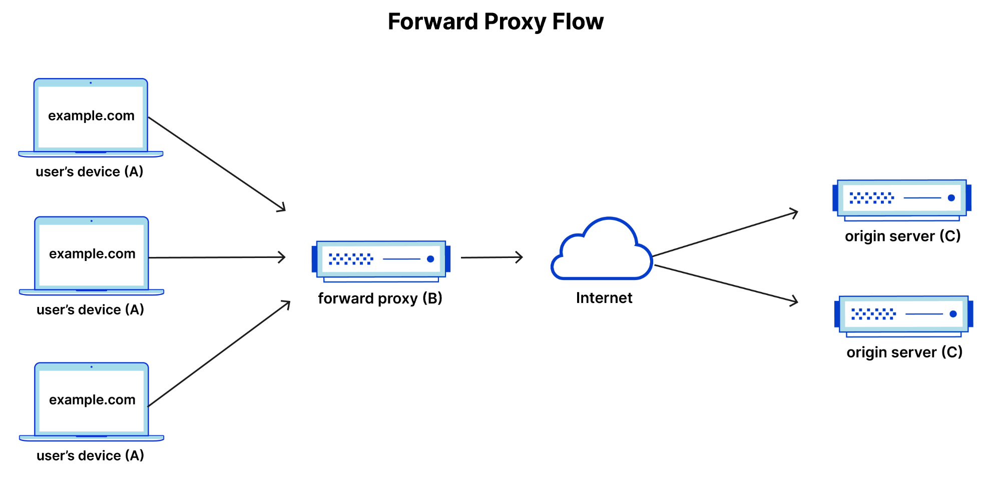
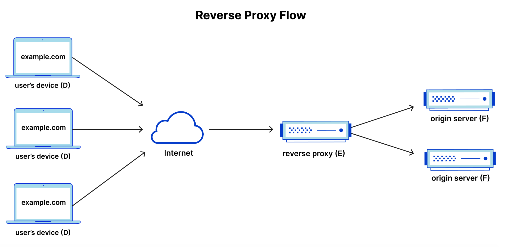
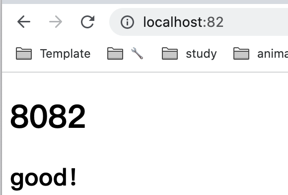
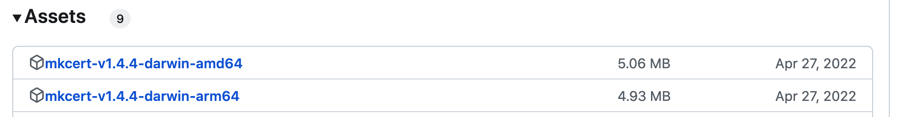
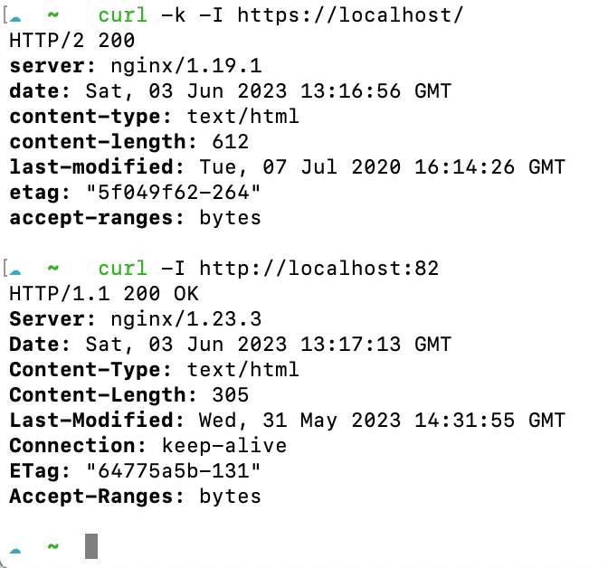

### nginx定义及作用

[Nginx](https://zh.wikipedia.org/wiki/Nginx) 是异步框架的[网页服务器](https://zh.wikipedia.org/wiki/網頁伺服器)，也可以用作[反向代理](https://zh.wikipedia.org/wiki/反向代理)、[负载平衡器](https://zh.wikipedia.org/wiki/负载均衡)和[HTTP缓存](https://zh.wikipedia.org/wiki/HTTP缓存)。

特点：专为性能优化而开发，占有内存少，并发能力强。


### nginx安装及启动

- [Windows系统的 安装步骤](https://cloud.tencent.com/developer/article/1795087)

​	在下载了nginx后，cmd下运行nginx.exe文件时，出现错误`nginx: [emerg] bind() to 0.0.0.0:80 failed (10013: An attempt was made to access a socket in a way forbidden by its access permissions)`意思是80端口被占用，只需要找到nginx 的配置文件conf文件，打开nginx.conf，把里面的`listen 80 `；改成没有占用的端口就可以了，然后cmd下运行`nginx.exe`文件，重启。


- [Mac 安装步骤](https://juejin.cn/post/6986190222241464350) 

  - 使用brew安装（我的mac版本老旧，会存在报错..）

    ```shell
    1.安装brew：官网地址：brew.sh
    /usr/bin/ruby -e "$(curl -fsSL https://raw.githubusercontent.com/Homebrew/install/master/install)"
    
    2.查找nginx版本
    brew search nginx
    
    3.安装nginx	#默认是最新版本
    brew install nginx
    
    4.卸载nginx
    brew uninstall nginx
    brew uninstall nginx@版本号
    
    5.查看nginx安装信息(eg:安装目录)
    brew info nginx
    #网页目录： /usr/local/var/www
    #默认配置文件：/usr/local/etc/nginx/nginx.conf
    #会被加载的配置文件: /usr/local/etc/nginx/servers/
    
    6.启动、停止、重启nginx
    brew services start nginx
    brew services stop nginx
    brew services restart nginx
    ```

    ```shell
    brew install nginx
    Warning: No available formula with the name "nginx".
    ==> Searching for similarly named formulae and casks...
    Error: No formulae or casks found for nginx.
    
    Warning: No available formula with the name "nginx".
    ==> Searching for similarly named formulae and casks...
    Warning: Calling plist_options is deprecated! Use service.require_root instead.
    Please report this issue to the denji/nginx tap (not Homebrew/brew or Homebrew/homebrew-core), or even better, submit a PR to fix it:
      /usr/local/Homebrew/Library/Taps/denji/homebrew-nginx/Formula/openresty.rb:81
    
    Warning: Calling plist_options is deprecated! Use service.require_root instead.
    Please report this issue to the denji/nginx tap (not Homebrew/brew or Homebrew/homebrew-core), or even better, submit a PR to fix it:
      /usr/local/Homebrew/Library/Taps/denji/homebrew-nginx/Formula/openresty-debug.rb:80
    ```

- [Docker 安装 Nginx](https://www.runoob.com/docker/docker-install-nginx.html)、[Docker 容器使用](https://www.runoob.com/docker/docker-container-usage.html)

拉取最新版的 Nginx 镜像：

```shell
docker pull nginx:latest
# docker pull nginx # 在docker hub 中选择合适的版本后进行 镜像拉取
```

**运行 nginx 容器**：

```cmd
docker run --name nginx-test -p 8080:80 -d nginx
0542e1db55de67676a2fe698eb4f689b40169f7b1876b681add233402da3bb0d
```

>  **--name** 自定义的容器名称。
>
>  **-p** 映射主机端口号到docker容器的端口号。
>
>  ​	这里端口8080即为外部web访问的端口号，而80则为nginx容器对外暴露的端口号。
>
>  **-d** 后台持续运行运行。

使用 docker start **启动一个已停止的容器**：

```cmd
docker ps -a
docker start db7307a31361
```


如截图，第二行是运行nginx-test的容器，打开页面输入网址http://localhost:8080/，能看见 Welcome to nginx! :kissing_heart:

同理，也可以直接在docker的dashboard操作：


***

那么接下来如何处理`nginx的配置`、`日志`、`静态资源`等内容？

#### 启动容器

以下命令使用 nginx 镜像启动一个容器：

```shell
docker images                                    
docker run -it nginx /bin/bash
```


>参数说明：
>
>**-i**: 以交互模式运行
>
>**-t**: 终端，为容器重新分配一个伪输入终端。-i 与 -t 通常同时使用
>
>**nginx**: nginx 镜像。
>
>**/bin/bash**：放在镜像名后的是命令，这里我们希望有个交互式 Shell，因此用的是 /bin/bash。
>
>要退出终端，直接输入 **exit**


#### 映射到本地目录

##### 查看nginx容器的配置资源目录

1. 进入容器，可以执行命令

```shell
方法一：
docker exec -it 0542e1db55de67676a2fe698eb4f689b40169f7b1876b681add233402da3bb0d /bin/sh
```

```shell
方法二：
docker exec -it container-id bash
docker exec -it container-id /bin/bash
```

>**container-id**:     容器id
>**bash (/bin/bash)**:	 linux 命令，启动一个bash终端，可与用户交互


2. 进入`容器bash终端`后，可以查看到nginx相关内容的`目录位置`如下：

> **log 日志文件目录**：		/var/log/nginx
> **config 配置文件目录**: 	/etc/nginx
> **web 资源存放目录**: 		/usr/share/nginx/html

注：这时候可以查看对应的文件信息，但不能使用vi查看文件内容，因为是`新的终端命令环境`，vi无法使用。可以使用 `cat` 命令。此外，使用 exit 命令可以退出容器当前终端命令环境。


#### 映射nginx目录

将nginx容器的配置日志资源等目录映射到本地主机目录下，需要在启动容器时，使用到 `-v` 命令，如：

```shell
docker run -d --name nginx \
-p 8080:80 \
-v /usr/nginx/html:/usr/share/nginx/html \
-v /usr/nginx/log:/var/log/nginx \
-v /usr/nginx/nginx.conf:/etc/nginx/nginx.conf \
nginx
```

> `-v` 是目录挂载，将本地目录映射到容器目录，后面直接修改本地目录下的内容，会同步到容器内。
>
>上面的命令，挂载了nginx的资源文件目录、日志目录、配置文件。

配置文件nginx.conf，会发现：

```shell
include /etc/nginx/conf.d/*.conf;
```

这是由于nginx容器除了加载主配置文件nginx.conf以外，还加载了conf.d目录下的子配置文件，通常最少有一个default.conf。所以，在启动容器时，也可以把该目录挂载出来：

```shell
-v /usr/nginx/conf.d:/etc/nginx/conf.d
```

> 也可以只使用nginx.conf修改配置，不使用conf.d的子配置，但docker容器默认的是使用自配置。

在挂载了内容资源后，就可以将静态web文件上传到对应的主机目录。
也可以直接在主机目录修改配置文件，然后重新启动nginx，就能生效。

```shell
docker stop nginx
docker start nginx
```


#### 拷贝容器资源

另外一种`更改配置资源内容`的方式，是使用 `docker cp` 命令

> docker cp :用于容器与主机之间的数据拷贝

通过该命令，就可以拷贝本地内容到容器里面去，如下面命令就可以将html文件拷贝到nginx容器的静态资源目录：

```js
docker cp /usr/nginx/html/mian.html nginx:/usr/share/nginx/html
```

也可以拷贝配置文件：

```js
// 从容器拷贝到本地目录
docker cp nginx:/etc/nginx/nginx.conf /usr/nginx/nginx.conf
// 从本地目录拷贝到容器
docker cp /usr/nginx/nginx.conf nginx:/etc/nginx/nginx.conf
```

通过拷贝的方式，可以`变更静态资源文件`，`修改配置文件`，`查看log日志`等。


#### 修改运行中的容器的端口的方法

- 停止 nginx 容器的运行，`docker stop nginx`
- 查看 nginx 容器的id，`docker inspect nginx | grep "Id"`, 会显示完整的容器Id
- 通用路径 /var/lib/docker/containers/{容器Id}/hostconfig.json，里面就存放有容器端口和本地端口，可以进行修改，通过 `vi` 命令查看、修改
  `80/tcp` 是容器端口，`HostPort: 8005` 是本地端口，可修改。
- 重启docker， `systemctl restart docker`
- 重启nginx容器， `docker start nginx`


***

### 1. 静态资源代理（动静分离）

#### 1.2 静态资源代理

为了`加快网站解析的速度`，可以把**动态资源 (jsp，servlet...) **和 **静态资源 (html，css，js，img...) **由不同的服务器来解析(分开部署)，加快解析速度，降低原来单个服务器的压力。



静态资源一般要和项目做分离，然后利用负载均衡加载静态资源。

```shell
docker run -di --name=nginx -p 90:80 -v /Users/zhangqian/Desktop/frontEnd/html/my-project:/usr/share/nginx/html nginx
# 5510b1dc79dabc93f206159b5d7ae94b92852004ef811b71249d1c6282b6af9c
```

> -d 后台运行 
>
> -i 交互方式运行
>
> --name 自定义容器名称 
>
> -p 端口号映射 90 自定义为外部访问端口：80 为nginx容器对外暴露的端口 
>
> -v 目录挂载  冒号前为 外部目录，冒号后为 容器内目录；相当于外部目录中的内容会映射同步到容器内




进入到容器命令：

```shell
docker exec -it 5510b1dc79dabc93f206159b5d7ae94b92852004ef811b71249d1c6282b6af9c /bin/sh
```

进入到容器的指定位置查看配置：

```shell
cd /etc/nginx/conf.d/
```


 **nginx.conf **：

```conf
user  nginx;
worker_processes  auto;

error_log  /var/log/nginx/error.log notice;
pid        /var/run/nginx.pid;

events {
    worker_connections  1024;
}

http {
    include       /etc/nginx/mime.types;
    default_type  application/octet-stream;

    log_format  main  '$remote_addr - $remote_user [$time_local] "$request" '
                      '$status $body_bytes_sent "$http_referer" '
                      '"$http_user_agent" "$http_x_forwarded_for"';

    access_log  /var/log/nginx/access.log  main;

    sendfile        on;
    #tcp_nopush     on;

    keepalive_timeout  65;

    #gzip  on;

    include /etc/nginx/conf.d/*.conf;
}
```

 **default.conf **：

```conf
server {
    listen       80;	 # 默认监听 80 端口
    listen  [::]:80;
    server_name  localhost;	# localhost 为外部访问该地址的域名   域名解析指向---> NGINX 配置文件所在服务器

    #access_log  /var/log/nginx/host.access.log  main;

    location / {	# 这里为本地代理，当外部访问 server_name 域名的时候 就会转到以下代理地址
        root   /usr/share/nginx/html;
        index  index.html index.htm;
    }

    #error_page  404              /404.html;

    # redirect server error pages to the static page /50x.html
    #
    error_page   500 502 503 504  /50x.html;
    location = /50x.html {
        root   /usr/share/nginx/html;
    }

    # proxy the PHP scripts to Apache listening on 127.0.0.1:80
    #
    #location ~ \.php$ {
    #    proxy_pass   http://127.0.0.1;
    #}

    # pass the PHP scripts to FastCGI server listening on 127.0.0.1:9000
    #
    #location ~ \.php$ {
    #    root           html;
    #    fastcgi_pass   127.0.0.1:9000;
    #    fastcgi_index  index.php;
    #    fastcgi_param  SCRIPT_FILENAME  /scripts$fastcgi_script_name;
    #    include        fastcgi_params;
    #}

    # deny access to .htaccess files, if Apache's document root
    # concurs with nginx's one
    #
    #location ~ /\.ht {
    #    deny  all;
    #}
}
```


***

#### 1.3 代理服务器（正向代理/http服务器）

转发代理，通常称为`代理`、`代理服务器`或 `Web 代理`，是位于一组客户端计算机之前的服务器。当这些计算机向 Internet 上的站点和服务发出请求时，代理服务器将拦截这些请求，然后代表客户端与 Web 服务器进行通信，起到中间设备的作用。



例如，典型的转发代理通信中涉及 3 台计算机：

> A：这是用户的家用计算机；
>
> B：这是一个转发代理服务器；
>
> C：这是网站的源站（用于存储网站数据）

使用转发代理可能有几个原因：**为避免机构的浏览限制**、**阻止访问某些内容**、**保护自己的在线身份**


#### 1.4 正向代理和反向代理的区别

> - 如果客户端自己用，就是正向代理。（需要在客户端中配置代理服务器）
> - 如果是在服务器用，用户无感知，就是反向代理。（只需将请求发到反向代理服务器中，由反向代理去选择目标服务器，获取数据后再返回客户端）

（`转发代理位于客户端的前面`，确保没有源站直接与该特定客户端通信；而`反向代理服务器位于源站前面`，确保没有客户端直接与该源站通信。）


+++

### 2. 反向代理Reverse Proxy（http反向代理/服务转发）

反向代理是位于一个或多个 Web 服务器前面的服务器，拦截来自客户端的请求。这与转发代理不同，在转发代理中，代理位于客户端的前面。使用反向代理，当客户端将请求发送到网站的源服务器时，反向代理服务器会在[网络边缘](https://www.cloudflare.com/learning/serverless/glossary/what-is-edge-computing/)拦截这些请求。然后，反向代理服务器将向源服务器发送请求并从源服务器接收响应。


#### 2.1 原理

其实客户端对代理是 `无感知 `的，因为客户端不需要任何配置就可以访问，我们只需要将请求发送到反向代理服务器，由反向代理服务器去选择目标服务器获取数据后，再返回给客户端，此时`反向代理服务器和目标服务器`对外就是一个服务器，暴露的是`代理服务器地址`，隐藏了真实服务器 `IP`地址。

> 注：反向代理服务器，怎么选择挂在它后面的哪一台具体服务器呢？答案在后面——负载均衡。

这一次，所涉及的计算机包括：

> D：任意数量的用户家用计算机；
>
> E：这是反向代理服务器；
>
> F：一台或多台源站





#### 2.2 反向代理作用

- **负载均衡** ——一个每天吸引数百万用户的热门网站可能无法使用单个源服务器处理所有传入站点流量。但该站点可以分布在不同服务器的池中，让所有服务器都处理同一站点的请求。在这种情况下，反向代理可以提供一种负载均衡解决方案，在不同服务器之间平均分配传入流量，以防止单个服务器过载。如果某台服务器完全无法运转，则其他服务器可以代为处理流量。

- **防范攻击** ——配备反向代理后，网站或服务无需透露其源服务器的 IP 地址。这使得攻击者更难利用针对性攻击，例如 DDoS 攻击。这时候，攻击者只能针对反向代理，例如 CDN，而后者拥有具有更严格的安全性，拥有更多资源来抵御网络攻击。
- **全局服务器负载平衡 (GSLB)** ——在这种负载均衡形式中，一个网站可以分布在全球各地的多个服务器上，反向代理会将客户端发送到地理位置上最接近它们的服务器。这样可以减少请求和响应传播的距离，从而最大程度地减少加载时间。
- **缓存** ——反向代理还可以缓存内容，从而提高速度。例如，如果巴黎的用户访问使用反向代理而 Web 服务器位于洛杉矶的网站，则该用户实际上可能连接到巴黎本地的反向代理服务器，然后该本地反向代理服务器必须与洛杉矶的源服务器进行通信。之后，代理服务器可以缓存（或临时保存）响应数据。随后浏览该站点的巴黎用户将从巴黎反向代理服务器处获取本地缓存的响应，从而享受到更快的性能。
- **SSL 加密** ——加密和解密每个客户端的 SSL（或 TLS）通信对于源服务器可能需要耗费大量计算资源。可以配置由反向代理解密所有传入请求并加密所有传出响应，腾出源服务器上的宝贵资源。

Nginx在做反向代理时，提供性能稳定，并且能够提供配置灵活的`转发功能`。Nginx可以根据不同的正则匹配，采取不同的转发策略，比如图片文件结尾的走文件服务器，动态页面走web服务器。

并且Nginx对返回结果进行错误页跳转，异常判断等。如果被分发的服务器存在异常，它可以将请求重新转发给另外一台服务器，然后自动去除异常服务器。


***

#### 2.3 反向代理-实战

我们可以通过 **proxy_pass** 来配置。

##### 简单配置

1）找到nginx配置文件 nginx.conf

由于是通过docker拉取的nginx，默认配置文件是nginx.conf中引入包含的default.conf文件
也就是说nginx.conf配置文件中有如下一个配置

> include /etc/nginx/conf.d/*.conf;


2）修改配置，实现反向代理

由于是在docker中实践，需要`在容器内修改文件`，此处采用 [vim编辑](https://blog.51cto.com/u_15127666/4112162) ，最后[保存退出 vim 编辑](https://blog.csdn.net/qq_37960603/article/details/82814939)。

```bash
apt-get update
apt-get install vim
vim nginx.conf	# 对my.cnf文件进行修改

# 保存退出
按 ESC键 跳到命令模式，然后:wq - 保存文件，退出vim

# 退出bash修改
Ctrl + d 			# 退出并停止容器
Ctrl + p + q 	# 退出并在后台运行容器
```

>将我的nginx.conf配置文件中 的内容替换到容器中的nginx.conf配置文件 中来实现

```shell
docker run --name nginxReverseProxy -p 8081:80 -d -v /Users/zhangqian/Desktop/frontEnd/nginx.conf:/etc/nginx/nginx.conf nginx
```

其中，本地的nginx.conf中http修改部分内容如下：`proxy_pass  http://www.baidu.com;`

```conf
http {
    include       mime.types;
    default_type  application/octet-stream;
    sendfile        on;
    keepalive_timeout  65;
    
    server {
        listen       80;
        server_name  localhost;

        location / {
            root   /usr/share/nginx/html;
            index  index.html index.htm;
	    			proxy_pass  http://www.baidu.com;	# 实现反向代理
   	 		}
    }
}
```

重启容器，之后在页面输入启动的ip端口，就能代理跳转到baidu.com了:relieved:


#### 复杂配置

根据不同的后缀名访问不同的服务器地址

根据访问的路径跳转到不同端口的服务中，Nginx 监听端口为 80

访问http://localhost:8081/document/ 直接跳转到 127.0.0.1:82
访问http://localhost:8081/education/ 直接跳转到 127.0.0.1:83

第一步，需要准备两个代理镜像，一个 82 端口，一个 83 端口，并准备好测试的页面

>/Users/zhangqian/Desktop/frontEnd/8082
>
>/Users/zhangqian/Desktop/frontEnd/8083
>
>在文件夹中放入index.html，注意名字对应！（nginx中默认是找index文件展示）

```shell
docker run -di --name=nginx -p 82:80 -v /Users/zhangqian/Desktop/frontEnd/8082.html:/usr/share/nginx/html nginx

docker run -di --name=nginx83 -p 82:80 -v /Users/zhangqian/Desktop/frontEnd/8083.html:/usr/share/nginx/html nginx
```

测试的页面：





第二步，修改 nginx 的配置文件，在 http 块中配置 server

```json
http {
    include       mime.types;
    default_type  application/octet-stream;
    sendfile        on;
    keepalive_timeout  65;

    server {
     location / {	# 这里为本地代理，当外部访问 server_name 域名的时候 就会转到以下代理地址
         root   /usr/share/nginx/html;
         index  index.html index.htm;
	   		 proxy_pass  http://www.baidu.com;
   	 }
		 location ~* ^/education$ {
     	   return http://127.0.0.1:82/; 
		 }

		 location ~* ^/document$ {
     	   return http://127.0.0.1:83/; 
   	 }
   }
}
```

打开`http://localhost:8081/document`，`http://localhost:8081/education` 即可跳转到相应的转发页面啦！:yum:


***

### nginx配置

上面做的所有配置（反向代理、动静分离等），都是基于nginx.conf的配置文件。

去掉注释信息后，可以将 nginx.conf 配置文件分为三部分：

#### **第一部分：全局块**

```text
 worker_processes  1;
```

从配置文件开始到 events 块之间的内容，主要会设置一些影响 Nginx 服务器整体运行的配置指令。

主要包括：配置运行 Nginx 服务器的用户（组）、允许生成的 worker process 数，进程 PID 存放路径、日志存放路径和类型以及配置文件的引入等。

上面这行 worker_processes 配置，是 Nginx 服务器`并发处理服务`的关键配置，该值越大，可以支持的并发处理量也越多，但是会受到硬件、软件等设备的制约。

#### **第二部分：events 块**

```text
events {
   worker_connections  1024;
}
```

主要影响 Nginx 服务器与`用户的网络连接`。

常用的设置包括：是否开启对多 work process下的网络连接进行序列化，是否允许同时接收多个网络连接，选取哪种事件驱动模型来处理连接请求，每个 wordprocess 可以同时支持的最大连接数等。

上述例子就表示每个 work process 支持的最大连接数为 1024。

这部分的配置对 Nginx 的`性能`影响较大，在实际中应该灵活配置。

#### **第三部分：http 块**

```text
http {
    include       mime.types;
    default_type  application/octet-stream;
    sendfile        on;
    keepalive_timeout  65;

    server {
        listen       80;
        server_name  localhost;

        location / {
            root   html;
            index  index.html index.htm;
        }

        error_page   500 502 503 504  /50x.html;
        location = /50x.html {
            root   html;
    }
}
```

这部分是 Nginx 服务器配置中最频繁的部分，`代理`、`缓存`和`日志定义`等绝大多数功能和`第三方模块的配置`都在这里。需要注意的是：http 块也可以包括 http 全局块、server 块。

**http 全局块**

http 全局块配置的指令包括：文件引入、MIME-TYPE 定义、日志自定义、连接超时时间、单链接请求数上限等。

**server 块**

这块和虚拟主机有密切关系，虚拟主机从用户角度看，和一台独立的硬件主机是完全一样的，该技术的产生是为了节省互联网服务器硬件成本。

每个 http 块可以包括多个 server 块，而每个 server 块就相当于一个虚拟主机。而每个 server 块也分为全局 server 块，以及可以同时包含多个 locaton 块。


#### 配置 location 块

Location 块通过指定模式来与客户端请求的URI相匹配。
Location基本语法：

- 匹配 URI 类型，有四种参数可选，当然也可以不带参数。
- 命名location，用@来标识，类似于定义goto语句块。

```crmsh
location [ = | ~ | ~* | ^~ ] /URI { … }
location @/name/ { … }
```

location匹配命令解释：

| 参数      | 解释                                                         |
| --------- | ------------------------------------------------------------ |
| **`空`**  | location 后没有参数直接跟着 **标准 URI**，表示前缀匹配，代表跟请求中的 URI 从头开始匹配。 |
| **`=`**   | 用于**标准 URI** 前，要求请求字符串与其精准匹配，成功则立即处理，nginx停止搜索其他匹配。 |
| **`^~`**  | 用于**标准 URI** 前，并要求一旦匹配到就会立即处理，不再去匹配其他的那些个正则 URI，一般用来匹配目录 |
| **`~`**   | 用于**正则 URI** 前，表示 URI 包含正则表达式， **区分**大小写 |
| **`~\*`** | 用于**正则 URI** 前， 表示 URI 包含正则表达式， **不区分**大小写 |
| **`@`**   | @ 定义一个命名的 location，@ 定义的locaiton名字一般用在内部定向，例如error_page, try_files命令中。它的功能类似于编程中的goto。 |

具体location匹配顺序见[引用链接🔗](https://segmentfault.com/a/1190000022315733) 。


+++

### 3.高级配置

#### 3.1 websocket

WebSocket是HTML5下一种新的协议。实现了浏览器与服务器`全双工通信`，能更好的节省服务器资源和带宽并达到实时通讯的目的。

它与HTTP一样通过已建立的TCP连接来传输数据，但是它和HTTP最大不同是：

> 1） WebSocket是一种双向通信协议。在建立连接后，WebSocket 服务器端和客户端都能主动向对方发送或接收数据，就像Socket一样；
>
> 2）WebSocket需要像TCP一样，先建立连接，连接成功后才能相互通信。

**WebSocket应用程序可以在客户端和服务器之间保持长时间运行的连接**，从而有助于开发实时应用程序。

Nginx从**「1.3」**版本开始支持WebSocket，其可以作为一个反向代理和为WebSocket程序做负载均衡。


**Nginx开启WebSocket代理的配置方法如下：**

**1）编辑nginx.conf，在http区域内一定要添加下面配置：**

```text
map $http_upgrade $connection_upgrade {
    default upgrade;
    '' close;
}
```

> map指令的作用：根据客户端请求中的值，来构造改变connection_upgrade的值，即根据变量的值创建新的变量connection_upgrade，创建的规则就是{}里面的东西。
>
> 其中的规则没有做匹配，因此使用默认的，即 :
>
> - 如果`$http_upgrade 不为 '' (空)，` 则$connection_upgrade 为 upgrade 。
> - 如果` $http_upgrade 为 '' (空)，` 则 $connection_upgrade 为 close。

**2）配置 WebSocket 服务器的地址**

```
upstream wsbackend{ 
	server ip1:port1; 
	# server ip2:port2; 
	keepalive 1000; 
} 
```

>表示的是 nginx负载均衡：
>
>- 两台服务器 (ip1:port1) 和 (ip2:port2) 。
>- keepalive 1000 表示的是每个nginx进程中上游服务器保持的空闲连接，当空闲连接过多时，会关闭最少使用的空闲连接。

**3）监听的服务器的配置**

```
server {
  listen 8021;
  location / {
     proxy_pass http://websocket;
     proxy_http_version 1.1;
     proxy_set_header Upgrade $http_upgrade;
     proxy_set_header Connection $connection_upgrade;
     proxy_set_header Host $host;
  }
}
```

>**proxy_pass http://websocket：** 表示反向代理的url
>
>**proxt_http_version 1.1：**反向代理发送的HTTP协议的版本是1.1，HTTP1.1支持长连接
>
>**proxy_set_header Upgrade $http_upgrade:** 表示设置Upgrade不变
>
>**proxy_set_header Connection `$connection_upgrade`:** 	表示如果 $http_upgrade为upgrade，则请求为upgrade(websocket)，如果不是，就关闭连接
>
>**proxy_set_header Host `$host`:** 	表示传递时请求头不变， $host是nginx内置变量，表示的是当前的请求头

此时，访问 `wss://localhost:20038` 就会被转发到 `ip1:port1` 和 `ip2:port2` 上。

**注：** 默认情况下，如果代理服务器在 60 秒内没有传输任何数据，连接将被关闭。可以使用proxy_read_timeout指令增加此超时 。

具体使用见下面实践👇


***

#### nginx配置websocket-实战

1、在docker中启动一个镜像

```shell
docker run --name nginxWebsocket -p 8022:8021 -d -v /Users/zhangqian/Desktop/frontEnd/websocket/nginx.conf:/etc/nginx/nginx.conf nginx
```

2、**websocket/nginx.conf**

```conf
user  nginx;
worker_processes  auto;

error_log  /var/log/nginx/error.log notice;
pid        /var/run/nginx.pid;


events {
    worker_connections  1024;
}

http {
    map $http_upgrade $connection_upgrade {
        default upgrade;
        '' close;
    }
 
    upstream websocket { # 代理地址
        server 121.42.165.18:8800;
    }
 
    server {
        listen 8021;
        location / {
            proxy_pass http://websocket;	# 代理上面的websocket，也可以直接写121.42.165.18:8800
            proxy_http_version 1.1;
            proxy_set_header Upgrade $http_upgrade;
            proxy_set_header Connection $connection_upgrade;
            proxy_set_header Host $host;
        }
    }
}
```

3、在websocket-test网站进行测试，[网址链接🔗](http://websocket-test.com)


即可看到连接了websocket！

***

**WebSocket 与 Http相同点：**

> 都是一样基于TCP的，都是可靠性传输协议。
>
> 都是应用层协议。

**WebSocket 与 Http不同点：**

> WebSocket 是双向通信协议，模拟Socket协议，可以双向发送或接受信息；HTTP是单向的。
>
> WebSocket 是需要浏览器和服务器握手进行建立连接的；HTTP是浏览器发起向服务器的连接，服务器预先并不知道这个连接。

**WebSocket 与 Http联系：**

> WebSocket在建立握手时，数据是通过HTTP传输的。但是建立之后，在真正传输时候是不需要HTTP协议的。
>
> 在WebSocket中，只需要服务器和浏览器通过HTTP协议进行一个握手的动作，然后单独建立一条TCP的通信通道进行数据的传送。

**WebSocket 连接的过程是：**

> 1）客户端发起http请求，经过3次握手后，建立起TCP连接；
>
> http请求里存放WebSocket支持的版本号等信息，如：Upgrade、Connection、WebSocket-Version等；
>
> 2）服务器收到客户端的握手请求后，同样采用HTTP协议回馈数据；
>
> 3）客户端收到连接成功的消息后，开始借助于TCP传输信道进行全双工通信。


***

#### 3.2 http2

HTTP 全称是Hypertext Transfer Protocol，是在1989年World Wide Web发展起来之后出现的标准协议，用来在WWW上传输数据。`HTTP/1.1`是1997年在原始的HTTP协议基础上进行的补充和优化。

到了2015年，为了适应快速发送的web应用和现代浏览器的需求，发展出了新的`HTTP/2`协议，主要在`手机浏览器`、`延时处理`、`图像处理`和`视频处理`方面进行了优化。

相对于HTTP1.1来说，HTTP2有如下几个优点：

1. 使用`多路复用`技术，在同一个连接中可以并行处理多个请求。
2. 可以`压缩HTTP头`，减少请求的大小。
3. 数据传输格式是以`二进制`进行的，所以传输更加有效。
4. `服务器可以向客户端推送数据`，从而让应用程序可以处理更加复杂的功能。

> 尽管HTTP2并不要求使用加密，但是对于现代浏览器来说如Google Chrome 和 Mozilla Firefox默认HTTP2和HTTPS是一起使用的，所以如果想配置HTTP2的话，还需要同时配置SSL。


#### nginx配置http2-实战

**1)开启HTTP2支持**

**nginx.conf** 参考: [docker-nginx-http2-ssl](https://github.com/stephenyu/docker-nginx-http2-ssl)

```text
user  nginx;
worker_processes  1;

error_log  /var/log/nginx/error.log warn;
pid        /var/run/nginx.pid;

events {
    worker_connections  1024;
}

http {
    include       /etc/nginx/mime.types;
    default_type  application/octet-stream;

    log_format main  '$remote_addr - $remote_user [$time_local] "$request" '
                      '$status $body_bytes_sent "$http_referer" '
                      '"$http_user_agent" "$http_x_forwarded_for"';

    access_log /var/log/nginx/access.log  main;

    sendfile        on;

    keepalive_timeout  65;

    server {
        listen 80 default_server;
        listen [::]:80 default_server;
        return 301 https://$host$request_uri;
    }

    server {
        listen 443 ssl http2 default_server;
        listen [::]:443 ssl http2 default_server;

        ssl_certificate     /ssl/cert.pem;
        ssl_certificate_key /ssl/key.pem;
        ssl_protocols       TLSv1 TLSv1.1 TLSv1.2;
        index index.html index.htm;
        ssl_ciphers         HIGH:!aNULL:!MD5;

        root /usr/share/nginx/html;
    }
}
```

默认情况下，nginx监听的端口是80，如下所示：

```text
listen 80 default_server;
listen [::]:80 default_server;
```

> 为什么会有两个listen呢？
>
> 第一个listen指的是所有的IPv4连接，第二个listen指的是IPv6连接。

因为HTTP2需要开启SSL支持，所以我们这里将其修改为443，并且加上http2支持如下所示：

```text
listen 443 ssl http2 default_server;
listen [::]:443 ssl http2 default_server;
```

重定向所有的HTTP请求到HTTPS：

> 默认情况下我们访问网站都是HTTP的，所以需要将HTTP请求重定向到HTTPS

```perl
server {
       listen         80;
       listen    [::]:80;
       server_name    www.flydean.com;
       return         301 https://$server_name$request_uri;
}
```


**2）添加SSL支持：SSL证书颁发机构**

要想`添加SSL支持`就需要`添加证书`，常用方式如下：

- 购买或者在网上有一些免费的SSL证书可用
- 如果只是在`测试环境`中，可以生成自签名证书

这里采用`生成自签名证书`的方式：用 [mkcert](https://github.com/FiloSottile/mkcert) 生成 SSL 密钥和证书文件。

> mkcert 是一个用于制作本地可信开发证书的简单工具。它不需要配置。
>
> 证书：用 `mkcert` 生成，对于macOS用户，可以`手动下载二进制安装mkcert`或者从`brew`安装mkcert。

**`brew`安装mkcert：**

```shell
brew install mkcert
brew install nss # if you use Firefox
```

**手动下载二进制安装 [mkcert](https://github.com/FiloSottile/mkcert/releases) ：**:point_left:（brew安装有问题的可以采用该方法）




```cmd
./mkcert-amd                 
# zsh: permission denied: ./mkcert-amd

frontEnd  chmod 777 mkcert-amd

./mkcert-amd        
Usage of mkcert:
	$ mkcert -install
	Install the local CA in the system trust store.
	$ mkcert example.org
	Generate "example.org.pem" and "example.org-key.pem".
	$ mkcert example.com myapp.dev localhost 127.0.0.1 ::1
	Generate "example.com+4.pem" and "example.com+4-key.pem".
	$ mkcert "*.example.it"
	Generate "_wildcard.example.it.pem" and "_wildcard.example.it-key.pem".
	$ mkcert -uninstall
	Uninstall the local CA (but do not delete it).
```

补：也可以使用openssl命令来完成 [生成自签名证书](https://www.cnblogs.com/flydean/p/15196067.html)。


**3）创建并安装 SSL 密钥和证书**：

因为通过手动下载方式，所以采用`./mkcert-amd`发起命令

`./mkcert-amd -install -key-file key.pem -cert-file cert.pem localhost.dev "*.localhost.dev" localhost 127.0.0.1 ::1`

```
./mkcert-amd -install -key-file key.pem -cert-file cert.pem localhost.dev "*.localhost.dev" localhost 127.0.0.1 ::1

Created a new local CA 💥
Sudo password:
The local CA is now installed in the system trust store! ⚡️
Warning: "certutil" is not available, so the CA can't be automatically installed in Firefox! ⚠️
Install "certutil" with "brew install nss" and re-run "mkcert -install" 👈
Created a new certificate valid for the following names 📜
 - "localhost.dev"
 - "*.localhost.dev"
 - "localhost"
 - "127.0.0.1"
 - "::1"
Reminder: X.509 wildcards only go one level deep, so this won't match a.b.localhost.dev ℹ️
The certificate is at "cert.pem" and the key at "key.pem" ✅
It will expire on 3 September 2025
```


**4）将文件挂载到容器中，在当前目录中托管文件**：

```
docker run -it -v /Users/zhangqian/Desktop/frontEnd/cert.pem:/ssl/cert.pem -v /Users/zhangqian/Desktop/frontEnd/key.pem:/ssl/key.pem  -p 80:80 -p 443:443 -d stephenyu/nginx-http2-ssl
```

注：没有 `-d` 这个窗口会一直占着


**5）检验成果**：导航到[https://localhost](https://localhost/)（或上面的任何名称，证书是为其生成的），就能够看到内容。


此处也可以通过命令查看：`curl -k -I https://localhost/`证书信息，此时可以清晰看到采用了`HTTP/2 200 `，对比别的端口服务，如 `curl -I http://localhost:82 `，可以发现HTTP不同：





> 注：这里可能会出现的问题，如果是自签名的证书，在chrome默认的安全环境中会认为这个证书是无效的，还需要将该证书加入证书的信任链中。


+++

### 4. 跨域

**只要`协议`，`域名`， `端口`，任意一个不一样，** **都算跨域**。

priflight说明是个预请求，CORS 机制跨域会首先进行 preflight（一个 OPTIONS 请求)， 该请求成功后才会发送真正的请求。 这一设计旨在确保服务器对 CORS 标准知情，以保护不支持 CORS 的旧服务器。


跨域主要涉及4个响应头：

> Access-Control-Allow-Origin 用于设置允许跨域请求源地址 （预检请求和正式请求在跨域时候都会验证）
>
> Access-Control-Allow-Headers 跨域允许携带的特殊头信息字段 （只在预检请求验证）
>
> Access-Control-Allow-Methods 跨域允许的请求方法或者说HTTP动词 （只在预检请求验证）
>
> Access-Control-Allow-Credentials 是否允许跨域使用cookies，如果要跨域使用cookies，可以添加上此请求响应头，值设为true（设置或者不设置，都不会影响请求发送，只会影响在跨域时候是否要携带cookies，但是如果设置，预检请求和正式请求都需要设置）。不过不建议跨域使用（项目中用到过，不过不稳定，有些浏览器带不过去），除非必要，因为有很多方案可以代替。

未完待续...